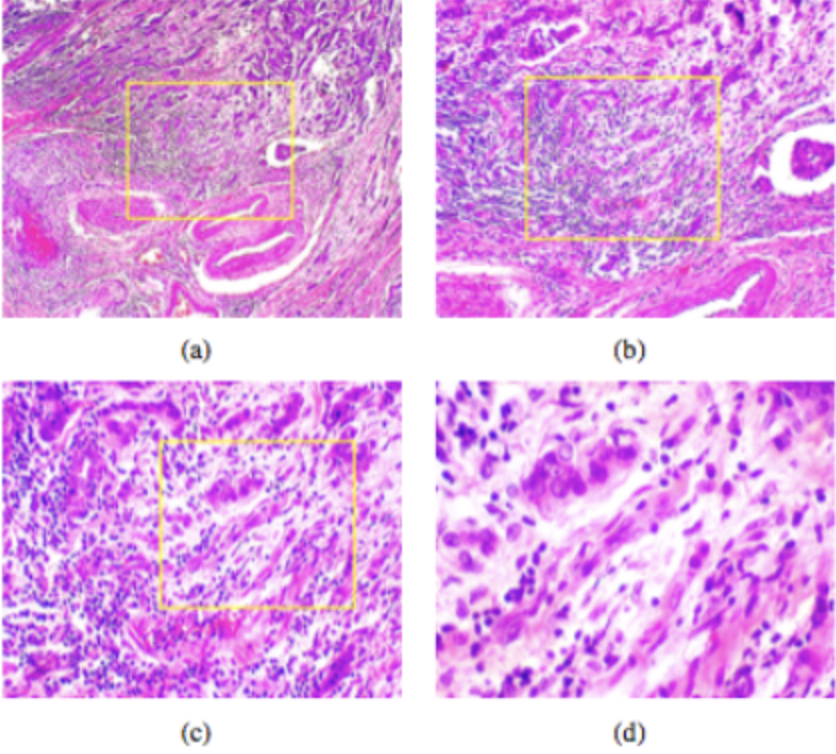

#  Proyecto - Detector Automatizado de Tumores Cáncer de Mama con Redes Neuronales Convolucionales

[Video Demo](https://drive.google.com/file/d/1mvCmi2XkMpkig0v9X3u08-PVtwchd3Tc/view?usp=sharing)

[Frontend en Github pages](https://jrbeduardo.github.io/proyecto-malaria/)

## Integrantes:  

- Leslie Guadalupe Pérez Montes
- Marían de los Ángeles Partida Contreras
- José Emanuel Tellez Soto

## Entegrables:

1. [Memoria Técnica](dev_model/MEMORIA-TECNICA.md)
1. [Documentación API](app/documentacion-api.md)

## Contexto

**Breast Cancer Histopathological Database (BreakHis)** fue desarrollada en colaboración con el Laboratorio de Investigación y Desarrollo en Anatomía Patológica y Citopatología de Paraná, Brasil, ofrece una herramienta valiosa para investigadores interesados en la evaluación y el desarrollo de nuevas metodologías para el análisis y diagnóstico del cáncer de mama.

## Objetivo del Proyecto

El propósito central del proyecto es desarrollar un modelo automatizado basado en Redes Neuronales Convolucionales (CNN) para clasificar imágenes de tomografías axiales computarizadas en dos categorías: "maligno" y "benigno". 

## Descripción General del Conjunto de Datos

El conjunto de datos BreaKHis está dividido en dos grupos principales: tumores benignos y tumores malignos. Histológicamente, un tumor benigno se refiere a una lesión que no cumple con los criterios de malignidad, como atipia celular marcada, mitosis, ruptura de membranas basales o capacidad de hacer metástasis. Generalmente, los tumores benignos son relativamente “inocuos”, crecen lentamente y permanecen localizados. Por otro lado, un tumor maligno es sinónimo de cáncer: estas lesiones pueden invadir y destruir estructuras adyacentes (invasión local) y diseminarse a sitios distantes (metástasis), lo que puede llevar a la muerte.

Tanto los tumores benignos como los malignos en mama pueden clasificarse en diferentes tipos según la apariencia de las células tumorales bajo el microscopio. Cada tipo o subtipo de tumor puede tener diferentes pronósticos e implicaciones terapéuticas. Actualmente, el conjunto de datos incluye cuatro tipos histológicamente distintos de tumores benignos de mama: adenosis (A), fibroadenoma (F), tumor filodes (PT) y adenoma tubular (TA); así como cuatro tipos de tumores malignos (cáncer de mama): carcinoma ductal (DC), carcinoma lobulillar (LC), carcinoma mucinoso (MC) y carcinoma papilar (PC).

Los nombres de los archivos de imagen contienen información específica sobre cada imagen, como el método de biopsia, la clase del tumor, el tipo de tumor, la identificación del paciente y el factor de aumento. Por ejemplo, el archivo **SOB_B_TA-14-4659-40-001.png** corresponde a la imagen número 1 de un tumor benigno de tipo adenoma tubular, tomada con un aumento de 40X, obtenida de la muestra de portaobjeto identificada como 14-4659 mediante el procedimiento SOB.

Las muestras del conjunto de datos fueron recolectadas utilizando el método SOB, también conocido como mastectomía parcial o biopsia excisional. Este procedimiento, a diferencia de los métodos de biopsia con aguja, extrae una muestra de tejido más grande y se realiza en un hospital bajo anestesia general.

 

- **Imágenes**: Diapositiva de tumor maligno de mama (teñido con HE) visto en diferentes factores de aumento: (a)40X,(b)100X,(c)200X y (d)400X.
- **Etiquetado**: Cada imagen en el conjunto de datos BreaKHis sigue un formato de nomenclatura que proporciona información detallada sobre la muestra. La estructura típica es:
Procedimiento_Clase_Tumoral_Tipo_Tumoral-Identificación_Paciente-Factor_Aumento-Número_Imagen.png

- **Formato**: Todas las imágenes están en formato PNG, lo que facilita su compatibilidad con herramientas de análisis de imágenes y procesamiento automatizado.
- **Dimensiones del conjuto**:  Este dataset cuenta con un número considerable de imágenes, convirtiéndose en una base sólida para desarrollar y entrenar modelos de aprendizaje profundo y otras técnicas avanzadas de análisis de datos.

Este proyecto ofrece una valiosa oportunidad para impulsar el desarrollo de soluciones tecnológicas innovadoras en la lucha contra el cáncer de mama, mejorando la precisión, eficiencia y rapidez en su diagnóstico y detección temprana.

## Referencias

- [1] Spanhol, F., Oliveira, L. S., Petitjean, C., Heutte, L., *A Dataset for Breast Cancer Histopathological Image Classification*, IEEE Transactions on Biomedical Engineering (TBME), 63(7):1455-1462, 2016. [PDF]

Puedes descargar la base de datos **BreaKHis** usando este enlace: [Descargar BreaKHis](https://www.dropbox.com/s/gwnfwcl8uq0hpl3/BreaKHis_v1.tar.gz?dl=0)
