# Memoria Técnica

## Portada
- **Nombre del Proyecto**: Detector Automatizado de Tumores Cáncer de Mama con Redes Neuronales Convolucionales
- **Fecha**: 5 de diciembre de 2024.
- **Integrantes**:  
  - Leslie Guadalupe Pérez Montes
  - Marían de los Ángeles Partida Contreras
  - José Emanuel Tellez Soto

## Índice
- [Portada](#portada)
- [Alcance del proyecto](#alcance-del-proyecto)
  - [Objetivo](#objetivo)
  - [Introducción](#introducción)
- [Fuentes de información y procedimientos aplicados](#fuentes-de-información-y-procedimientos-aplicados)
  - [Construcción del modelo](#construcción-del-modelo)
  - [Resultados modelo](#resultados-modelo)
  - [Pruebas sobre el modelo](#pruebas-sobre-el-modelo)
  - [Conclusiones](#conclusiones)
- [Conclusiones generales](#conclusiones-generales)
- [Anexos](#anexos)
- [Glosario](#glosario)

## Alcance del proyecto

### Objetivo
El propósito central del proyecto es desarrollar un modelo automatizado basado en Redes Neuronales Convolucionales (CNN) para clasificar imágenes histopatológicas en dos categorías: "maligno" y "benigno". Este sistema está diseñado para asistir a profesionales de la salud en el diagnóstico temprano del cáncer de mama, reduciendo el tiempo de análisis y mejorando la precisión en la detección de tumores. El proyecto busca contribuir al ámbito médico mediante la integración de técnicas avanzadas de inteligencia artificial en el proceso de diagnóstico.

### Introducción

El cáncer de mama es una de las principales causas de muerte en mujeres a nivel mundial. El diagnóstico temprano y preciso es esencial para mejorar las probabilidades de tratamiento exitoso y supervivencia. Tradicionalmente, el diagnóstico se basa en la evaluación manual de imágenes histopatológicas bajo microscopio, un proceso que requiere experiencia y tiempo y que a menudo está sujeto a variabilidad en la interpretación.

Los avances en inteligencia artificial, particularmente en deep learning, han abierto nuevas posibilidades para automatizar y mejorar la precisión del diagnóstico. Este proyecto implementa una **Red Neuronal Convolucional (CNN)**, una arquitectura especializada en el procesamiento de datos visuales para construir un clasificador de imágenes histopatológicas que detecte automáticamente tumores benignos y malignos en muestras de tejido mamario, optimizando el diagnóstico y reduciendo la carga de trabajo del personal médico.

## Fuentes de información y procedimientos aplicados

A lo largo del proyecto desarrollamos varios modelos, cada uno con el objetivo de mejorar la clasificación de las imágenes. En la memoria técnica presentamos el primer modelo con el que iniciamos, y posteriormente se puede observar un avance significativo en los modelos siguientes. Aunque algunos modelos mostraron métricas prometedoras, no clasificaban correctamente en ciertos casos, lo que nos llevó a iterar y refinar nuestras aproximaciones.

El usuario puede acceder a estos modelos en la carpeta [Documentación API](app/documentacion-api.md), donde se encuentran organizados para facilitar su revisión. Además, en la carpeta dev_model se incluyen dos notebooks principales:
  - `creacion_de_nuetra_CNN`: Documenta los primeros modelos que desarrollamos como punto de partida.
  - `2_Creación_de_nuestra_CNN`: Contiene varios modelos, incluyendo el modelo final, mostrando el progreso logrado en nuestras iteraciones.
Finalmente, también se incluye el notebook `Prueba_modelos`, donde se documentan las pruebas realizadas a los diferentes modelos desarrollados durante el proyecto. Esta estructura permite al usuario explorar el proceso de diseño y mejora de los modelos de manera clara y detallada.
### **MODELO 1**
El conjunto de datos, descargado de BreakHis, pertenece a la clasificación de imágenes histopatológicas del cáncer de mama. Este conjunto de datos esta compuesto por los siguientes archivos:

  - **images**.
  Proporciones Iniciales (Usadas para entrenar los primeros dos modelos):
    - `imagenes_benigno`: Imagenes benignas.
    - `imagenes_maligno`: Imagenes malignas. 
    - Total de imágenes: 7954
---

## Pipeline de Preparación
### 1. Crear Etiquetas Binarias
- Clasificamos las imágenes basándonos en si son benignas o malignas, su distribución:
  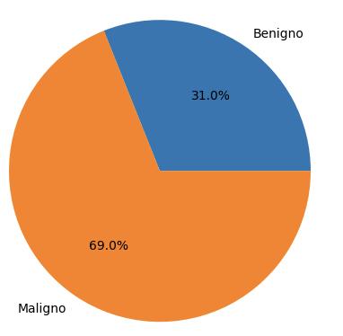
### 2. División del Conjunto de Datos
- Los datos se dividen en entrenamiento y validación con proporciones del 69% y 31% respectivamente.

  | Conjunto         | Cantidad de Imágenes |
  |-------------------|----------------------|
  | Entrenamiento     | 6364               |
  | Validación        | 1590                 |
  

  - **Total de imágenes:** 7954
  - **Etiquetas:**
    - **Imágenes benignas:** 1976 imágenes
    - **Imágenes malignas:** 4388 imágenes

### 3. Preprocesamiento
Antes de usar las imágenes, se realiza un escalado de sus píxeles para mejorar el rendimiento del modelo:
- **Escalado:** Los valores de los píxeles se convierten de `[0, 255]` a `[0, 1]`.

## Construcción del modelo 1

La red que construimos se basa en una arquitectura de **red neuronal convolucional (CNN)**, una técnica ideal para problemas de visión por computadora. Las CNNs son capaces de extraer características clave de las imágenes, como texturas, bordes y patrones complejos, que son esenciales identificar tumores malignos y benignos en muestras de tejido mamario.

Este fue el primer modelo que hicimos, el cual tiene tres capas convolucionales y tiene una función de perdida.
### Aquitectura

| **Layer (type)**           | **Output Shape**         | **Param #** |
|----------------------------|--------------------------|-------------|
| `rescaling (Rescaling)`     | (None, 224, 224, 3)     | 0           |
| `conv2d (Conv2D)`          | (None, 224, 224, 16)    | 448         |
| `max_pooling2d (MaxPooling2D)` | (None, 112, 112, 16)    | 0           |
| `conv2d_1 (Conv2D)`        | (None, 112, 112, 32)    | 4,460       |
| `max_pooling2d_1 (MaxPooling2D)` | (None, 56, 56, 32)     | 0           |
| `conv2d_2 (Conv2D)`        | (None, 56, 56, 64)      | 18,496      |
| `max_pooling2d_2 (MaxPooling2D)`        | (28,28, 64)          | 0           |
| `dropout (Dropout)`          | (28,28, 64)               | 0         |
| `flatten (Flatten)`            | (None, 50176)             | 0  |
| `dense (Dense)`          | (None, 128)               | 6,422,656         |
| `dense_1 (Dense)`          | (None, 2)               | 258         |

#### **Totales**
- **Total params:** 6,446,498
- **Trainable params:** 6,446,498
- **Non-trainable params:** 0

### Funcionamiento del modelo
1. Las imágenes se pasan a través de tres capas convolucionales para extraer características espaciales.
1. Las capas de MaxPooling reducen las dimensiones de las características.
1. La capa de Flatten transforma los datos en un vector plano.
1. Las capas densas realizan la clasificación basada en las características extraídas.
1. Capa de salida. Una sola neurona con una función de activación sigmoide produce una probabilidad entre 0 y 1.

### Problemas 

Esta red no es adecuada para la tarea de clasificación de tumores benignos y malignos porque:

- Tiene solo tres capas convolucionales y tiene una función de pérdida. 
- Los modelos entrenados con esta proporción eran muy buenos clasificando tumores malignos lo que generaba una disminución de falsos negativos; lo cual en el contexto es muy bueno.
- Los modelos eran “malos” clasificando tumores como benignos. Al haber tenido un mayor número de ejemplos malignos, los modelos trataban de “forzar” a clasificar las imágenes como tal; debido a que no aprendió lo suficiente de benignos para poder generalizar bien. Esto desembocó en tener muchos falsos positivos.

## Resultados modelo

El modelo muestra signos claros de sobreajuste.

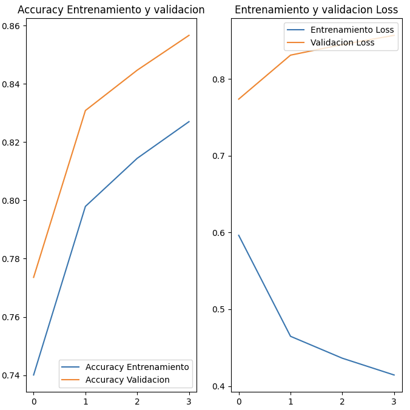

### **Precisión (Accuracy)**:

  - **Entrenamiento**: La precisión no alcanza valores cercanos a 1.0 rápidamente, indicando un ajuste malo a los datos de entrenamiento.
  - **Validación**: La precisión de validación es 0.8575.

### **Pérdida (Loss)**:

- **Entrenamiento**: La pérdida disminuye en 0.4052
 
## Pruebas sobre el modelo
### MODELO 1: *cancer_modelo_2*
Primero, evaluamos con f1-score, de donde tenemos los siguientes resultados :

- F1-Score (ponderado): 0.8533874660761027
- F1-Score para la clase 'benign': 0.76
- F1-Score para la clase 'malignant': 0.90

Del mismo modo, calculamos la curva ROC, junto con su AUC:
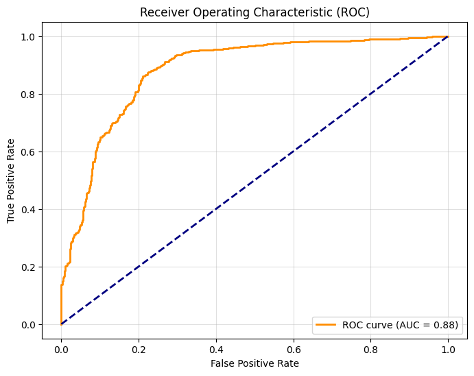

### **Matriz de Confusión**

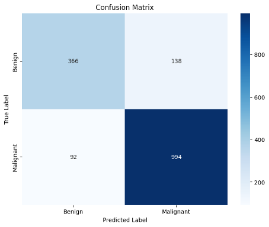

### **3. F1-Score**

Con un F1-Score de 0.853 pensaríamos que nos indica un balance excelente entre precisión y recall; sin embargo los modelos eran “malos” clasificando tumores como benignos.

## Conclusiones

- Los modelos entrenados con esta proporción mostraron un alto rendimiento en la clasificación de tumores malignos, lo que resultó en una notable reducción de falsos negativos. Esto es particularmente beneficioso en el contexto clínico, ya que ayuda a minimizar el riesgo de no detectar casos malignos que podrían requerir atención inmediata. No obstante, los modelos tuvieron un desempeño limitado al clasificar tumores benignos. Esto se debe a la mayor cantidad de ejemplos de tumores malignos en el conjunto de entrenamiento, lo que llevó a que los modelos priorizaran esta categoría y "forzaran" la clasificación de imágenes como malignas. En consecuencia, el modelo no logró aprender lo suficiente sobre los tumores benignos, lo que resultó en un elevado número de falsos positivos. Esta desproporción evidencia la necesidad de un balance adecuado en los datos de entrenamiento para mejorar la capacidad de generalización del modelo.
---
### **MODELO 2.**
Dados los problemas presentados en el modelo 1, se decidió hacer un nuevo modelo que fue entrenado con la distribución original de los datos.
  - **images**.
  Proporciones Iniciales (Usadas para entrenar los primeros dos modelos):
    - `imagenes_benigno`: Imagenes benignas.
    - `imagenes_maligno`: Imagenes malignas. 
    - Total de imágenes: 8350
---

### Distribución de original de clases

La gráfica a continuación muestra la distribución original de las clases:

---

## Pipeline de Preparación
### 1. Crear Etiquetas Binarias
- Clasificamos las imágenes basándonos en tumor maligno o tumor benigno.

### 3. Preprocesamiento
Antes de usar las imágenes, se realiza un escalado de sus píxeles para mejorar el rendimiento del modelo:
- **Escalado:** Los valores de los píxeles se convierten de `[0, 255]` a `[0, 1]`.
---
## Construcción del modelo 2

La red que construimos se basa en una arquitectura de **red neuronal convolucional (CNN)**.

### Aquitectura

| **Layer (type)**           | **Output Shape**         | **Param #** |
|----------------------------|--------------------------|-------------|
| `rescaling_2 (Rescaling)`     | (None, 224, 224, 3)     | 0           |
| `conv2d_6 (Conv2D)`          | (None, 224, 224, 64)    | 1,792         |
| `max_pooling2d_6 (MaxPooling2D)` | (None, 112, 112, 64)    | 0           |
| `conv2d_7 (Conv2D)`        | (None, 112, 112, 64)    | 36,928       |
| `max_pooling2d_7 (MaxPooling2D)` | (None, 56, 56, 64)     | 0           |
| `conv2d_8 (Conv2D)`        | (None, 56, 56, 64)      | 18,496      |
| `max_pooling2d_8 (MaxPooling2D)`        |  (None, 28, 28, 64)     | 0      |
| `dropout_2 (Dropout)`        | (None, 28, 28, 64)      | 18,496      |
| `flatten_2 (Flatten)`        | (None, 50176)          | 0           |
| `dense_4 (Dense)`            | (None, 128)             | 6,422,656  |
| `dense_5 (Dense)`          | (None, 2)               | 258         |

#### **Totales**
- **Total params:** 6,498,562
- **Trainable params:** 6,498,562
- **Non-trainable params:** 0

### Funcionamiento del modelo 2
1. **Capa de Rescaling:**
  - La capa inicial `(rescaling_2)` escala los valores de los píxeles de las imágenes de entrada al rango [0, 1]. Esto es necesario para normalizar los datos y facilitar el entrenamiento.
1. **Capas Convolucionales (Conv2D):**
  - El modelo tiene tres capas convolucionales (`conv2d_6`, `conv2d_7`, `conv2d_8`) con 64 filtros cada una, que extraen características espaciales como bordes, texturas y patrones. Estas capas permiten identificar relaciones locales en las imágenes.
1. **Capas de Reducción de Dimensionalidad (MaxPooling2D):**
  - Las capas de MaxPooling (`max_pooling2d_6`, `max_pooling2d_7`, `max_pooling2d_8`) reducen las dimensiones espaciales de las características extraídas, conservando las más relevantes y reduciendo el costo computacional.
1. **Capa de Regularización (Dropout):**
  - La capa de Dropout (`dropout_2`) desactiva aleatoriamente el 50% de las neuronas durante el entrenamiento para prevenir el sobreajuste y mejorar la capacidad de generalización del modelo.
1. **Capa de Aplanamiento (Flatten):**
  - La capa `flatten_2` convierte las características extraídas (un tensor tridimensional) en un vector plano, preparándolas para la entrada a la red totalmente conectada (Dense).
1. **Capas Densas:**
  - La primera capa densa (`dense_4`) tiene 128 neuronas y utiliza una función de activación ReLU para aprender combinaciones no lineales de las características extraídas.
  - La segunda capa densa (`dense_5`) es la capa de salida y tiene 2 neuronas (una para cada clase: benigno y maligno) con una función de activación softmax, que produce las probabilidades de clasificación.

Este modelo emplea una arquitectura convolucional para extraer y procesar características espaciales de las imágenes, reduciendo su dimensionalidad progresivamente. Finalmente, usa una red densa para realizar la clasificación binaria (benigno vs. maligno), ajustándose mediante regularización para mejorar su capacidad de generalización.

### Problemas 

Esta red no es adecuada para la tarea de clasificación de tumores benignos y malignos porque:

- Tiene solo tres capas convolucionales y tiene una función de pérdida. 
- Se generó un aumento casi del 100% de las imágenes benignas que se tenían originalmente. Lo cual puede resultar peligroso si no se genera bien y comprometer la calidad de las imágenes generadas, lo que se traduciría como meter mucho ruido al modelo o que este aprenda características de las imágenes modificadas que no tienen mucha relación con las imágenes originales.
- Se invirtió la proporción, ahora la clase benigna es la predominante. lo cual terminó por generar los mismos problemas que se describieron en la sección anterior, pero ahora con benignos.
- Aumento de falsos negativos. Los modelos aprendían mejor a detectar los tumores benignos y eran muy erráticos con los tumores malignos.

## Resultados modelo

El modelo muestra signos claros de sobreajuste.

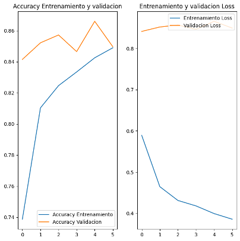

### **Precisión (Accuracy)**:

  - La precisión en el conjunto de entrenamiento (línea azul) aumenta de manera constante con el número de épocas, indicando que el modelo está aprendiendo patrones de los datos.
  - La precisión en el conjunto de validación (línea naranja) es relativamente estable con ligeras fluctuaciones, alcanzando valores similares o incluso superiores a la precisión del entrenamiento.
  - Este comportamiento sugiere que el modelo generaliza bien y presenta señales evidentes de sobreajuste (overfitting).

### **Pérdida (Loss)**:

- **Entrenamiento**: La pérdida disminuye en 0.4261
 
## Pruebas sobre el modelo
### MODELO 2: *cancer_modelo_3*
Primero, evaluamos con f1-score, de donde tenemos los siguientes resultados :

- F1-Score (ponderado): 0.8488934160473666
- F1-Score para la clase 'benign': 0.76
- F1-Score para la clase 'malignant': 0.89

Del mismo modo, calculamos la curva ROC, junto con su AUC:
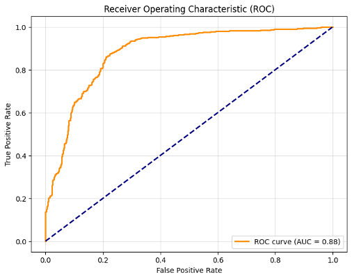

### **Matriz de Confusión**

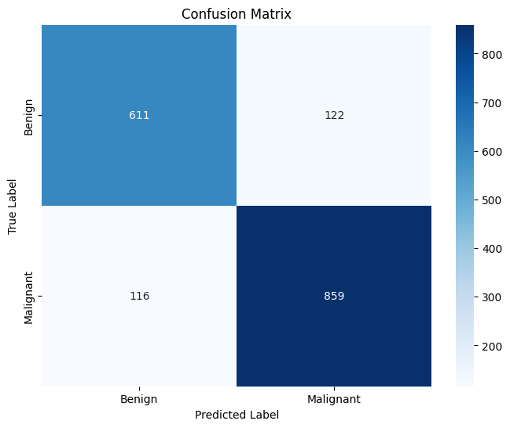

### **3. F1-Score**

Con un F1-Score de 0.84 pensaríamos que nos indica un balance excelente entre precisión y recall; sin embargo generaó los mismos problemas que se describieron en la sección anterior, pero ahora con benignos.

## Conclusiones

- El aumento artificial de imágenes benignas casi duplicó la cantidad original, pero esto introdujo varios desafíos importantes:

1. **Riesgos de la generación de datos:**
    - Si las imágenes generadas no tienen la calidad suficiente o presentan características irrelevantes respecto a las originales, el modelo puede aprender patrones incorrectos. Esto podría introducir ruido significativo, comprometiendo su capacidad para generalizar correctamente.
2. **Desbalance de clases invertido:**
    - Al invertir la proporción de las clases, la categoría benigna se volvió predominante, replicando los problemas previos pero en sentido opuesto. Los modelos mostraron un desempeño errático al clasificar tumores malignos, lo que resultó en un aumento de falsos negativos.
    Este problema es crítico en el contexto clínico, ya que no identificar correctamente tumores malignos puede tener consecuencias graves en los pacientes.
3. **Evaluación de métricas:**
    - Aunque el modelo alcanzó un F1-Score de 0.84, que a simple vista podría interpretarse como un buen balance entre precisión y recall, esta métrica no refleja adecuadamente los problemas de clasificación desbalanceada. Los falsos negativos en tumores malignos evidencian la necesidad de interpretar las métricas en función del contexto y no solo de su valor numérico.
4. **Implicaciones generales:**
    - El modelo aprendió a detectar tumores benignos con mayor precisión, pero redujo su capacidad para identificar malignos, esto refuerza la importancia de mantener un equilibrio en las clases del conjunto de datos y garantizar la calidad de los datos generados, especialmente en aplicaciones sensibles como la clasificación de tumores.

---
### **MODELO 3.**
Dados los problemas presentados en el modelo 2, se decidió hacer un nuevo modelo.
- **images**.
  Proporciones Iniciales (Usadas para entrenar los primeros dos modelos):
    - `imagenes_benigno`: Imagenes benignas.
    - `imagenes_maligno`: Imagenes malignas. 
    - Total de imágenes: 8544
---

### Distribución de original de clases

La gráfica a continuación muestra la distribución de las clases, con un aumento 60-40:

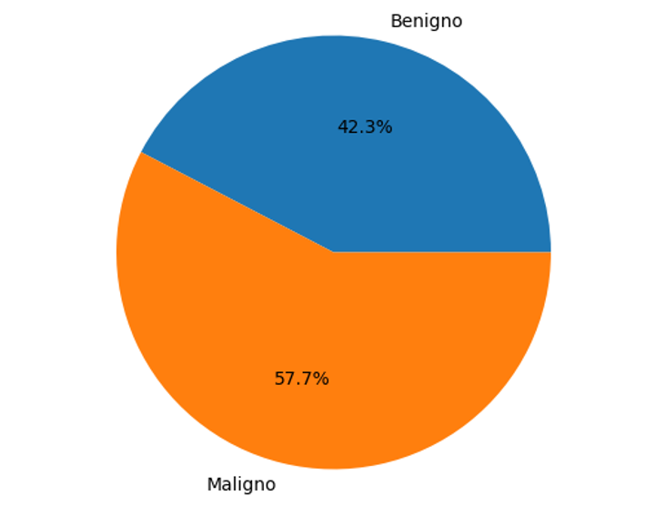

- **Etiquetas:**
    - **Imágenes benignas:** 3618 imágenes
    - **Imágenes malignas:** 4926 imágenes
    - **Total de imágenes:** 8544 imágenes

- La proporción de 60% malignos y 40% benignos (o cercana) resulta más adecuada porque permite equilibrar la importancia clínica de los tumores malignos con la necesidad de incluir suficientes datos de tumores benignos para garantizar la generalización del modelo. 

- Dado que los falsos negativos en tumores malignos son significativamente más críticos, esta proporción asegura que el modelo cuente con suficiente información para identificar las características distintivas de los casos malignos. Al mismo tiempo, se preserva una representación considerable de tumores benignos, evitando que el modelo sesgue excesivamente sus predicciones hacia la clase mayoritaria, lo que podría comprometer su desempeño general. 

- Este enfoque facilita un análisis robusto y representativo, alineándose con la necesidad de minimizar errores clínicamente relevantes.

---

## Pipeline de Preparación
### 1. Crear Etiquetas Binarias
- Clasificamos las imágenes basándonos en tumor maligno o tumor benigno.

### 3. Preprocesamiento
Antes de usar las imágenes, se realiza un escalado de sus píxeles para mejorar el rendimiento del modelo:
- **Escalado:** Los valores de los píxeles se convierten de `[0, 255]` a `[0, 1]`.
---
## Construcción del modelo 3

La red que construimos se basa en una arquitectura de **red neuronal convolucional (CNN)**.

### Aquitectura

| **Layer (type)**           | **Output Shape**         | **Param #** |
|----------------------------|--------------------------|-------------|
| `resnet50 (Functional) `     | (None, 7, 7, 2048)     | 23,587,712           |
| `flatten_2 (Flatten)`          | (None, 100352)    | 0         |
| `dense_4 (Dense)` | (None, 256)    | 0           |
| `dropout_2 (Dropout)`        | (None, 256)    | 514       |
| `dense_5 (Dense)` | (None, 56, 56, 64)     | 0           |

#### **Totales**
- **Total params:** 49,278,594
- **Trainable params:** 25,690,882
- **Non-trainable params:** 23,587,712

### Funcionamiento del modelo 3
1. **Capa Base (ResNet50):**
  - La arquitectura preentrenada **ResNet50** sirve como extractor de características, utilizando pesos preentrenados en ImageNet.
  - Produce un tensor de salida de forma (`7, 7, 2048`), que representa las características profundas extraídas de las imágenes.
1. **Capa de Aplanamiento (Flatten):**
  - La capa `flatten_2` convierte el tensor tridimensional de salida de ResNet50 en un vector unidimensional (`100352` valores) para ser procesado por las capas densas.
1. **Capas Densas:**
  - La primera capa densa (`dense_4`) tiene 256 neuronas y utiliza una función de activación ReLU para aprender combinaciones no lineales de las características extraídas.
  - Se aplica una capa de Dropout (`dropout_2`) con una tasa de desactivación para prevenir el sobreajuste.
  - La capa de salida (`dense_5`) tiene 2 neuronas con función de activación softmax para clasificar las imágenes en dos categorías (benigno y maligno), produciendo probabilidades para cada clase.
1. **Parámetros Entrenables y no Entrenables:**
  - **Parámetros entrenables:** `25,690,882`, que corresponden a las capas densas y posiblemente a las últimas capas de ResNet50 si se optó por *fine-tuning*.
1. **Parámetros no entrenables:** `23,587,712`, provenientes de los pesos congelados de ResNet50 durante el entrenamiento.

### Posibles desventajas 
- El modelo tiene **25,690,882 parámetros entrenables**, lo que implica un alto costo computacional y una mayor probabilidad de sobreajuste si los datos de entrenamiento son limitados. 
- La capacidad del modelo puede ser excesiva para el tamaño del dataset, especialmente si el número de imágenes es bajo, lo que podría llevar a un ajuste excesivo a los datos de entrenamiento.
- **ResNet50 preentrenada** puede no estar perfectamente adaptada al dominio específico (imágenes de tumores), dado que está entrenada con imágenes generales de ImageNet.
- Como se utilizaron técinas de aumento de datos en este modelo para generar imágenes adicionales, nuestro modelo puede aprendar patrones no representativos de las imágenes reales que compromete su capacidad de generalización.
- La ResNet50 tiene **23,587,712 parámetros no entrenables**, lo que, combinado con los parámetros entrenables, resulta en un modelo pesado (187.98 MB), lo que lleva a requerir GPUs de alto rendimiento para el entrenamiento.

## Resultados modelo

El modelo muestra signos ligeros de sobreajuste.

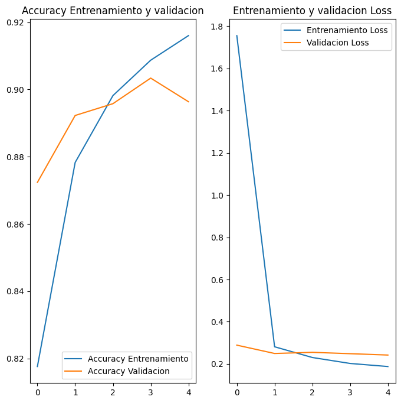

Aunque este fue el modelo que mejores resultados de predicción dio, es posible notar un ligero indicio de sobreajuste.  Esto debido a que a pesar de que las métricas de validación no empeoran drásticamente, el modelo comienza a mostrar una brecha entre el desempeño en entrenamiento y validación, especialmente en las últimas épocas.
Por lo que aún hay partes del modelo a mejorar. Algunas alternativas pueden ser agregar regularización o hacer un mejor aumento de datos.
 
## Pruebas sobre el modelo
### MODELO 3: *cancer_modelo_trans*
Primero, evaluamos con f1-score, de donde tenemos los siguientes resultados :

- F1-Score (ponderado): 0.8957454649837822
- F1-Score para la clase 'benign': 0.87
- F1-Score para la clase 'malignant': 0.91

Del mismo modo, calculamos la curva ROC, junto con su AUC:
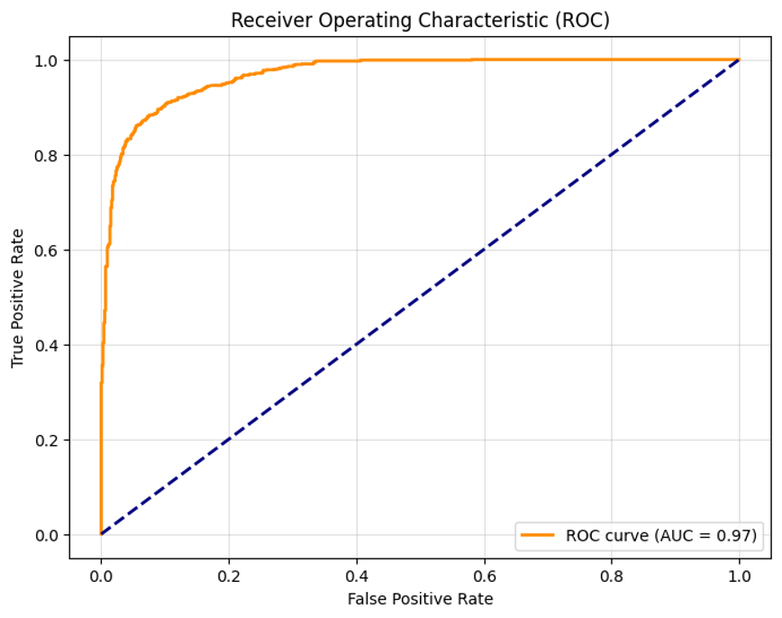
- Una curva ROC muy pegada a los ejes, así como un AUC ≈ 0.97. lo que señala que es nuestro mejor modelo 
### **Matriz de Confusión**

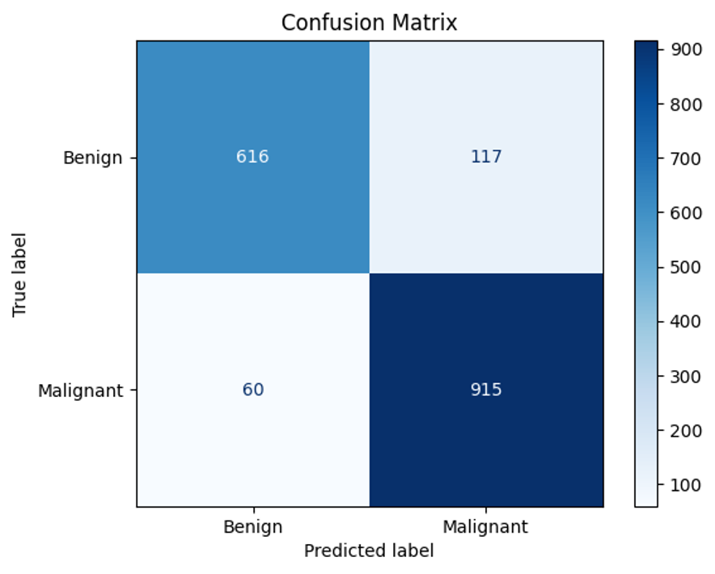
- matriz de confusión: Aunque detectamos Beningos como malignos, vemos que logramos reducir la cantidad de cáncer malignos que estaban clasificados como Beningos. Lo que quiere decir que cumplimos con nuestro objetivo
## Conclusiones
El principal objetivo es garantizar la detección efectiva de tumores malignos, dada su importancia clínica. A partir de los resultados del modelo final, se pueden destacar lo siguiente:
- **Buen desempeño general**: El modelo alcanzó un F1-score ponderado de aproximadamente 0.9, lo que indica que, en términos generales, clasifica de manera precisa tanto tumores benignos como malignos.
- **Alta sensibilidad en tumores malignos:** Con un F1-score específico de aproximadamente 0.91 para la clase maligna, se asegura una detección confiable de los casos de cáncer maligno en las imágenes, minimizando falsos negativos. Esto es crucial en este contexto, ya que priorizar la detección de tumores malignos puede marcar la diferencia en el diagnóstico y tratamiento oportunos.

---

## Conclusiones generales
El modelo final fue seleccionado porque cumple con los objetivos principales del problema, priorizando la correcta detección de tumores malignos, que es crucial en este contexto clínico. En particular, el modelo destaca por las siguientes razones:

- *Buen F1-score ponderado (~0.9):* Esto indica que el modelo mantiene un buen desempeño general, logrando un equilibrio adecuado entre precisión y recall en ambas clases. Esto sugiere que, de manera global, el modelo clasifica correctamente la mayoría de las imágenes.

- *F1-score de ~0.91 en la clase maligna:* Este valor asegura que el modelo tiene una alta capacidad para identificar correctamente los tumores malignos, reduciendo significativamente los falsos negativos en esta clase crítica. Esto es esencial para minimizar el riesgo de que un tumor maligno pase desapercibido, lo cual es clínicamente prioritario.

Nuestro modelo final combina un desempeño general robusto con un enfoque específico en la detección de tumores malignos, lo que lo convierte en la mejor opción para las necesidades y objetivos planteados en este problema de clasificación.

El clasificador de imágenes histopatológicas del cáncer de mama basado en redes neuronales convolucionales constituye un avance crucial en la automatización del diagnóstico oncológico. Con un alto nivel de precisión y capacidad de generalización, este modelo puede optimizar la detección temprana y el manejo del cáncer de mama, mejorando significativamente la calidad del diagnóstico en contextos médicos, especialmente en regiones con recursos limitados y alta demanda de atención especializada.

Este proyecto demuestra cómo la inteligencia artificial puede revolucionar el diagnóstico del cáncer de mama mediante imágenes histopatológicas:

- **Rápido y Preciso:** El modelo permite identificar tumores benignos y malignos en tiempo real, optimizando la detección temprana y mejorando las tasas de diagnóstico efectivo.
- **Económico:** La automatización reduce la dependencia de especialistas altamente capacitados, haciéndolo viable para clínicas y hospitales con recursos limitados.
- **Escalable:** Esta tecnología puede adaptarse a la clasificación de otras patologías basadas en imágenes, ampliando su impacto en diversas áreas de la medicina.

## Anexos
- [Repositorio Github](https://github.com/clasicancer/Casificancer)
- [Conjunto de Datos para la Detección de Cáncer de Mama](http://www.inf.ufpr.br/vri/databases/BreaKHis_v1.tar.gz)

## Glosario

Este glosario proporciona una breve descripción de los términos relacionados con la clasificación de cáncer de mama utilizados en el proyecto.

### **1. Cáncer de Mama**
- **Definición:** El cáncer de mama es una enfermedad en la que las células del tejido mamario crecen de manera descontrolada, formando un tumor maligno que puede invadir tejidos cercanos o diseminarse a otras partes del cuerpo a través de la sangre o el sistema linfático.
- **Importancia:** Es el tipo de cáncer más común entre las mujeres a nivel mundial, representando una causa significativa de mortalidad y morbilidad. La detección temprana y el tratamiento adecuado son esenciales para mejorar las tasas de supervivencia y reducir el impacto en la calidad de vida de las pacientes.
### **2. Imágenes Histopatológicas**
- **Definición:** Las imágenes histopatológicas son representaciones visuales de cortes finos de tejido que han sido teñidos y observados bajo un microscopio. Estas imágenes permiten estudiar la arquitectura celular y tisular, identificando características relacionadas con enfermedades, como el cáncer.
- **Importancia:** Son fundamentales en el diagnóstico y clasificación de enfermedades, ya que proporcionan información detallada sobre la estructura y comportamiento celular. En el caso del cáncer, estas imágenes permiten diferenciar entre tejidos normales, benignos y malignos, guiando decisiones clínicas y estrategias de tratamiento.
### **3. Clasificación de Imágenes**
- **Definición:** Proceso automatizado en el que un modelo de aprendizaje profundo, como una red neuronal convolucional (CNN), categoriza imágenes en clases específicas, como "maligno" o "benigno", basándose en patrones detectados en los datos visuales.
### **4. Histología Mamaria**
- **Definición:** Estudio de la estructura microscópica de los tejidos mamarios. Permite identificar diferencias clave entre tejidos normales, benignos y malignos, lo cual es crucial para el entrenamiento de modelos de clasificación.

### **5. Tipos Histológicos de Tumores Mamarios**
- **Definición:** Clasificación de los tumores según la apariencia de las células bajo el microscopio. Ejemplos incluyen adenosis, fibroadenoma, carcinoma ductal y carcinoma lobular. Estas categorías son las etiquetas utilizadas en los modelos de clasificación de imágenes.

### **6. Datos de Entrenamiento**
- **Definición:** Conjunto de imágenes histopatológicas anotadas con información sobre la clase y tipo de tumor. Es esencial para que el modelo aprenda a diferenciar entre tumores benignos y malignos.

### **7. Magnificación (Factor de Aumento)**
- **Definición:** Nivel de zoom aplicado en las imágenes histopatológicas (como 40X, 100X, 200X, 400X). La variación en los factores de aumento permite al modelo analizar características a diferentes escalas y mejorar la precisión de la clasificación.

### **8. Características Microscópicas de Tumores**
- **Definición:** Rasgos visuales observados en las imágenes histopatológicas, como la disposición celular, tamaño de los núcleos y presencia de mitosis. Estas características son clave para entrenar al modelo de clasificación.
### **9. Etiquetado de Imágenes**
- **Definición:** Proceso de asignar una clase y tipo de tumor a cada imagen en el dataset. Este etiquetado es la base para que el modelo aprenda a asociar patrones visuales con categorías específicas.

### **10. Sensibilidad y Especificidad**
- **Definición:**
  - **Sensibilidad:** Capacidad del modelo para identificar correctamente las imágenes de tumores malignos.
  - **Especificidad:** Capacidad del modelo para clasificar correctamente las imágenes de tumores benignos.
- Ambas métricas son críticas para evaluar el rendimiento del modelo.

### **11. Lesión Premaligna**
- **Definición:** Cambios celulares que aún no son malignos pero presentan un riesgo elevado de convertirse en cáncer. Su identificación precisa es importante para la detección temprana y la intervención.
### **12. Métodos de Biopsia**
- **Definición:** Procedimientos para obtener muestras de tejido mamario, como la biopsia excisional (SOB). Estas muestras se utilizan para crear las imágenes histopatológicas empleadas en el modelo de clasificación.
### **13. Red Neuronal Convolucional (CNN)**
- **Definición:** Arquitectura de redes neuronales artificiales diseñada específicamente para procesar datos con estructuras de cuadrícula, como imágenes. Utiliza operaciones de convolución para extraer automáticamente características relevantes.
### **14. Clasificación Binaria**
- **Definición:** Tarea de aprendizaje automático en la que el modelo clasifica los datos en una de dos categorías, como "maligno" o "benigno".
### **15. Tumor Maligno**
- **Definición:** Crecimiento anormal de células que puede invadir tejidos cercanos y propagarse a otras partes del cuerpo.
- **Importancia:** Representa una amenaza significativa para la salud debido a su capacidad de invadir órganos vitales y diseminarse (metástasis), lo que puede conducir a complicaciones graves e incluso la muerte. Su identificación temprana y tratamiento adecuado son esenciales para mejorar los resultados clínicos.
### **16. Tumor Benigno**
- **Definición:** Masa celular no cancerosa que no invade tejidos circundantes ni se disemina a otras áreas del cuerpo.
- **Importancia:** Aunque no representa un riesgo directo de metástasis como los tumores malignos, su crecimiento puede causar complicaciones dependiendo de su tamaño y ubicación, como presión sobre órganos o estructuras cercanas. Además, algunos tumores benignos tienen el potencial de transformarse en malignos, lo que resalta la importancia de su monitoreo y tratamiento oportuno.
### **17. Dataset**
Definición: Conjunto estructurado de datos utilizado para entrenar y evaluar el modelo de clasificación.
### **18. Entrenamiento**
- **Definición:** Proceso mediante el cual la red neuronal aprende patrones en los datos de entrada ajustando los pesos de sus conexiones a través de algoritmos de optimización.
### **19. Validación**
- **Definición:** Proceso de evaluación del rendimiento del modelo en un conjunto de datos separado del de entrenamiento, utilizado para prevenir el sobreajuste y medir la capacidad de generalización.
### **20. Sobreajuste (Overfitting)**
- **Definición:** Situación en la que un modelo se adapta demasiado a los datos de entrenamiento, lo que deteriora su desempeño en datos nuevos o no vistos.
### **21. Precisión (Accuracy)**
- **Definición:** Métrica de evaluación del desempeño de un clasificador, definida como la proporción de clasificaciones correctas entre el total de clasificaciones realizadas.
### **22. Tasa de Falsos Positivos (False Positive Rate)**
- **Definición:** Proporción de casos benignos que son clasificados incorrectamente como malignos.
### **23. Tasa de Falsos Negativos (False Negative Rate)**
- **Definición:** Proporción de casos malignos que son clasificados incorrectamente como benignos.
### **24. Keras**
- **Definición:** Biblioteca de alto nivel en Python diseñada para construir y entrenar modelos de aprendizaje profundo de manera sencilla e intuitiva.
### **25. TensorFlow**
- **Definición:** Plataforma de código abierto para construir, entrenar y desplegar modelos de aprendizaje automático y redes neuronales profundas.

[def]: #documentacion-api